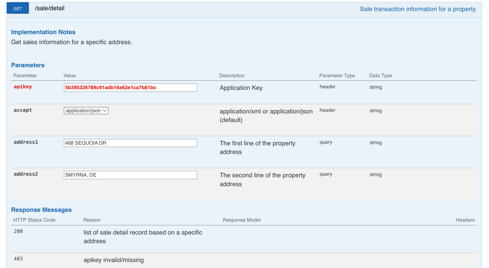
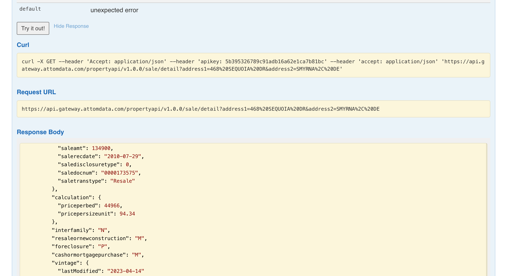
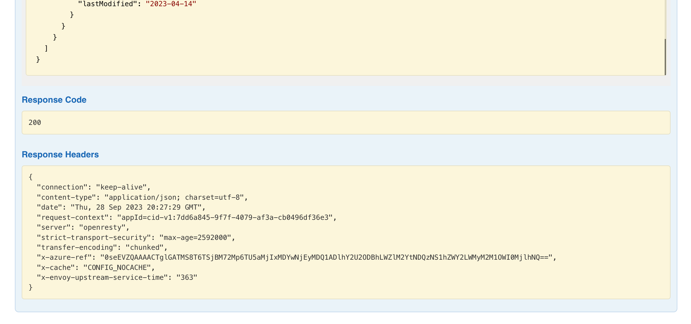

# House Findr
## Overview:
House Findr aims to simplify the process of finding a house by consolidating listings, providing filters, and offering
personalized recommendations.

## Sub-Domains:
### 1. User Authentication
- **Objective:** Securely manage user registrations, logins, and sessions.
- **Features:**
    - Registration (Contact Information)
    - Login

### 2. Listing Aggregation
- **Objective:** Aggregate house listings from various sources for comprehensive options.
- **Features:**
    - API Integration
    - Listing Updates

### 3. Search and Filters
- **Objective:** Facilitate users in finding houses based on their preferences and criteria.
- **Features:**
    - Keyword Search
    - Advanced Filters (Location, Price, Size, Amenities)

### 4. Personalization and Recommendations
- **Objective:** Provide personalized house recommendations based on user behavior and preferences.
- **Features:**
    - User Profiles
    - Recommendation Algorithm

### 5. User Interface and Experience
- **Objective:** Ensure an intuitive and responsive user interface for ease of use.
- **Features:**
  - Responsive Design
  - User Input

### 6. Geolocation and Mapping
- **Objective:** Integrate maps and geolocation for visualizing house locations and exploring neighborhoods.
- **Features:**
  - Map Integration
  - Location Markers
  - Neighborhood Information

## Target Users
- **House Seekers:** Individuals or families looking to buy or rent a house.
- **Real Estate Agencies:** Agencies looking to list and promote houses.
- **House Owners:** Independent house owners looking to sell or rent out their properties.

## External Systems and Dependencies
- **Listing Providers:** Real estate websites and agencies providing house listings.
- **Map Services:** Services like Google Maps for geolocation and mapping.

## Link to API
https://api.developer.attomdata.com/home

## Try out the API




## Example output of our java code
```
200
{"status":{"version":"1.0.0","code":0,"msg":"SuccessWithResult","total":1,"page":1,"pagesize":10,"transactionID":"fb13d9678d3a0287ea01ac63f110c641"},"property":[{"identifier":{"Id":147435254,"fips":"10001","apn":"1-17-010.14-06-28.00-000","attomId":147435254},"lot":{"depth":1101,"frontage":220,"lotnum":"28","lotsize1":0.0600092,"lotsize2":2614,"pooltype":"NO POOL"},"area":{"loctype":"VIEW - NONE","countrysecsubd":"Kent","countyuse1":"P    ","muncode":"KE","munname":"KENT","subdname":"WOODLAND MANOR PHASE I","taxcodearea":"17"},"address":{"country":"US","countrySubd":"DE","line1":"468 SEQUOIA DR","line2":"SMYRNA, DE 19977","locality":"SMYRNA","matchCode":"ExaStr","oneLine":"468 SEQUOIA DR, SMYRNA, DE 19977","postal1":"19977","postal2":"2542","postal3":"C008"},"location":{"accuracy":"Rooftop","latitude":"39.302906","longitude":"-75.594321","distance":0.0,"geoid":"CO10001, CS1093700, DB1001620, PL1067310, RS0000330264, SB0000077305, SB0000077308, SB0000077309, SB0000077310, ZI19977","geoIdV4":{"CO":"81170d77f7d7af98e7ffda998420037b","CS":"c62c66b7bb1078a885466fb1e70d78e8","DB":"8a0647f3e91a30c6fbe985dc15c89aa7","N4":"4741ad8af80e166c95e392d2e6b1d08c","PL":"c58b0a51b2efb816ce61a2a5bfe23990","SB":"1cd8129d79d6eb8081ce2a1e63b3c7dd,72208bd5d07e7ffa6c9e910592e45640,b8fb9d70b63a74307b486b19b72acd55,3192d428b94c8a47d6f25959739b47eb","ZI":"11ebffd4a3224a7663b4f2941a220c6f"}},"summary":{"absenteeInd":"OWNER OCCUPIED","propclass":"Single Family Residence / Townhouse","propsubtype":"Residential","proptype":"SFR","propertyType":"SINGLE FAMILY RESIDENCE","yearbuilt":2006,"propLandUse":"SFR","propIndicator":"10","legal1":"WOODLAND MANOR LOT 28 468 SEQUOIA DRIVE"},"utilities":{"coolingtype":"YES","heatingtype":"CENTRAL"},"building":{"size":{"bldgsize":1430,"grosssize":2145,"grosssizeadjusted":1430,"livingsize":1430,"sizeInd":"LIVING SQFT","universalsize":1430},"rooms":{"bathfixtures":10,"bathsfull":2,"bathspartial":1,"bathstotal":3.0,"beds":3,"roomsTotal":6},"interior":{"bsmtsize":715,"bsmttype":"FINISHED"},"construction":{"condition":"GOOD","constructiontype":"FRAME","frameType":"WOOD","wallType":"ALUMINUM/VINYL"},"parking":{},"summary":{"archStyle":"OTHER","bldgType":"CONVENTIONAL HOUSE","imprType":"HOUSE","levels":2,"quality":"AVERAGE","storyDesc":"CONVENTIONAL HOUSE","view":"VIEW - NONE","viewCode":"000"}},"vintage":{"lastModified":"2023-04-14","pubDate":"2023-04-14"},"sale":{"salesearchdate":"2010-07-29","saleTransDate":"2010-07-16","amount":{"saleamt":134900,"salerecdate":"2010-07-29","saledisclosuretype":0,"saledocnum":"0000173575","saletranstype":"Resale"},"calculation":{"priceperbed":44966,"pricepersizeunit":94.34},"interfamily":"N","resaleornewconstruction":"M","foreclosure":"P","cashormortgagepurchase":"M","vintage":{"lastModified":"2023-04-14"}}}]}
```

## Technical problem blocking process
- **Format of api response:** Needs to be further analyzed and organized
